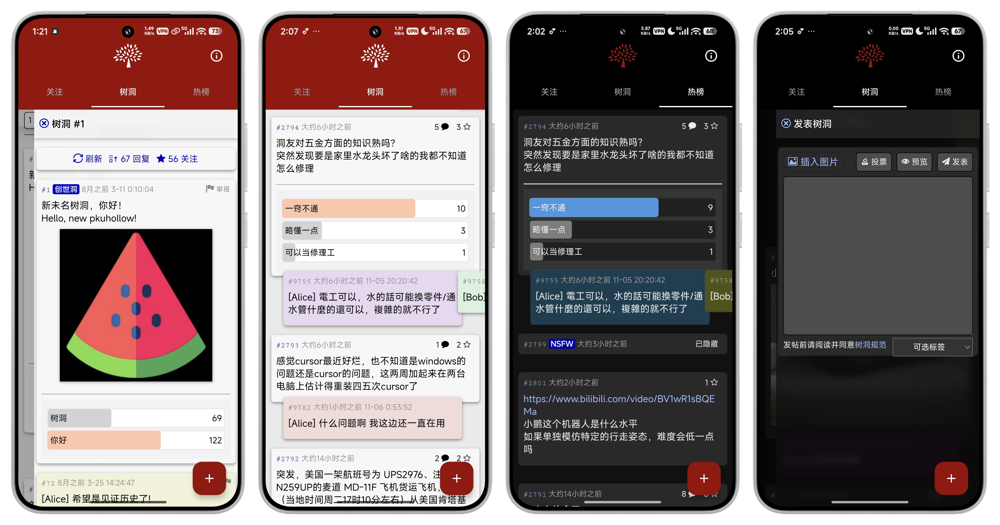

# 新未名树洞 - PKU Hollow

## 介绍

P 大的朋友们大家好，很高兴看到北大未名树洞复活！

激动之余，我发现它目前只有网页版，刷起来不是很方便。一番逆向分析后我发现这个网页版其实可以利用，于是一个基于动态注入的安卓端就这样诞生了。

由于开发者并没有提供官方的数据接口，因此本质上这个应用还是一个浏览器，所有功能都通过注入网页版进行实现。

## 如何使用

开发者在洞内的 #63 说过自己缺乏信息安全相关经验，而本应用的开发形式较为特殊，其原理可能被恶意利用，因此我选择发布但不开源的形式。应用已经做过代码混淆、加壳、反检测以及签名校验，请大家合理使用。

请前往 [Release](https://github.com/AaronComo/PKU-Hollow/releases/tag/v1.0) 页面下载最新 apk 安装包。

## 重要声明

1. 本应用非官方平台，仅供学习交流，严禁用于商业用途。**请于下载后24小时内删除**。
2. 使用本应用所造成的一切问题由使用者自行承担责任，**开发者不承担任何责任**。
3. 本应用提供的服务在**中国大陆无法访问**。

## 致谢

- [新未名树洞网页版](https://github.com/pkuhollow2)
- [P 大树洞网页版](https://github.com/xmcp/webhole)
- [T 大树洞网页版](https://github.com/treehollow/webhole)
- [Claude](https://claude.ai/login?returnTo=%2F%3F)
